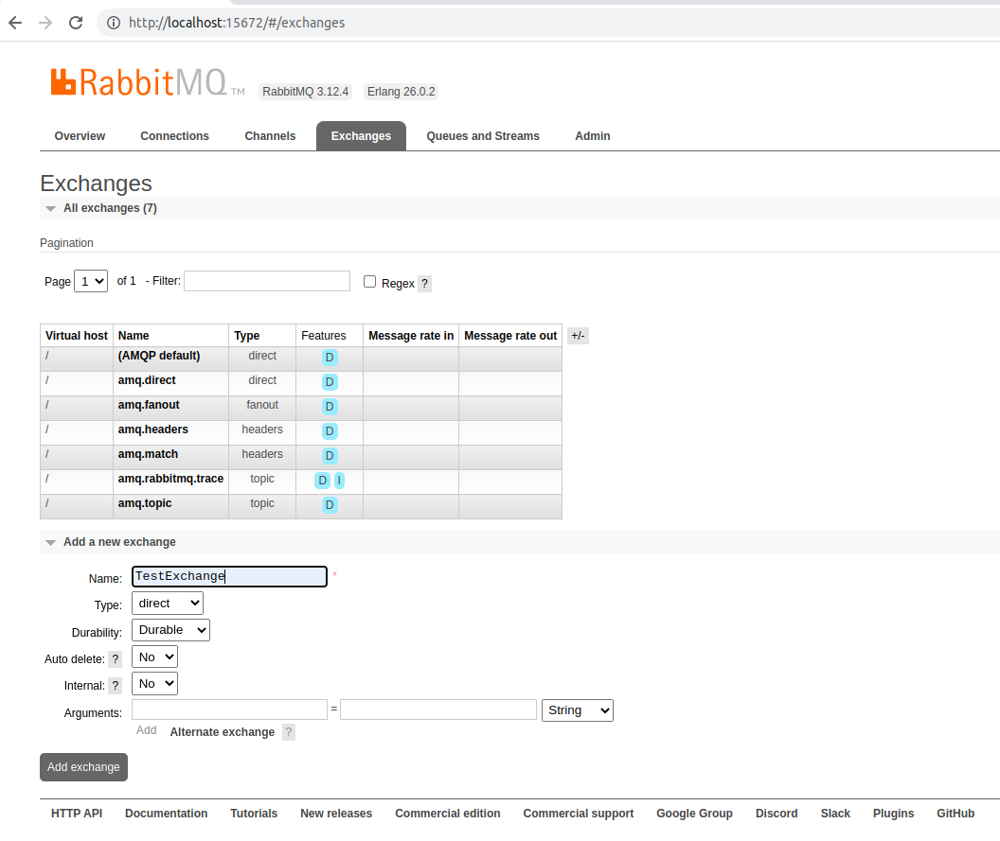
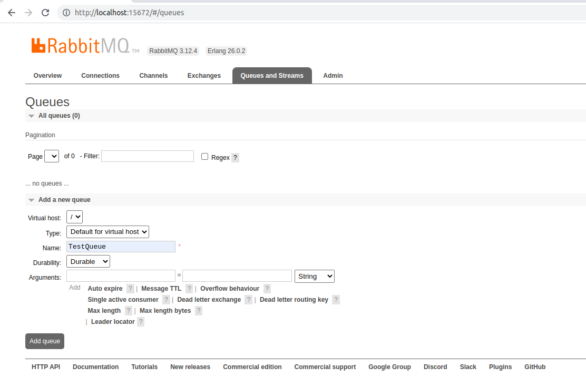
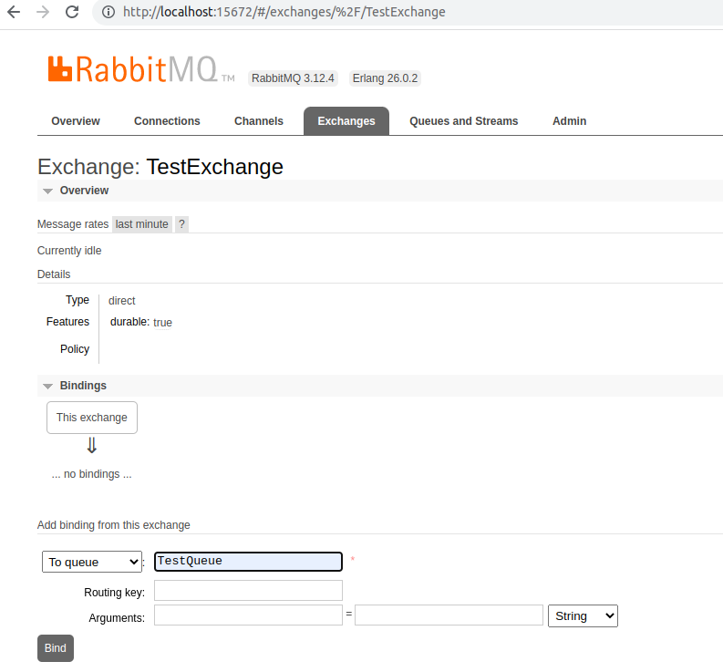
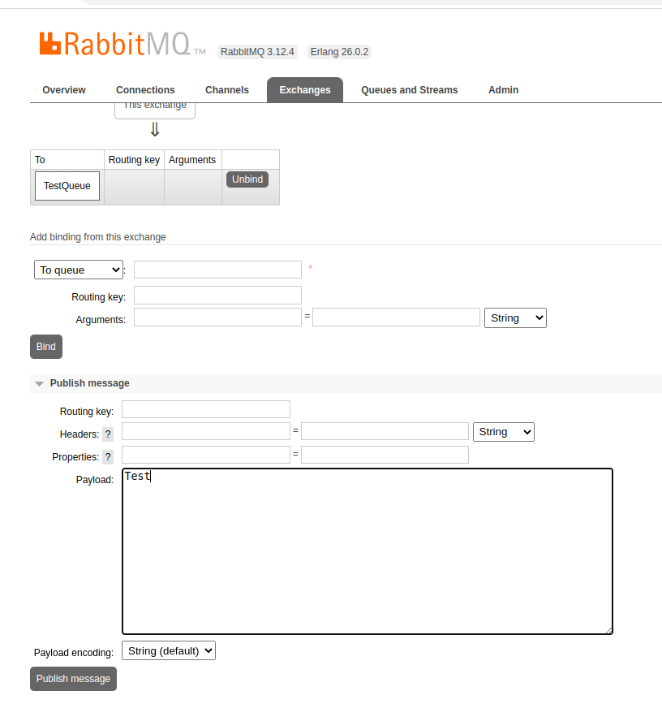
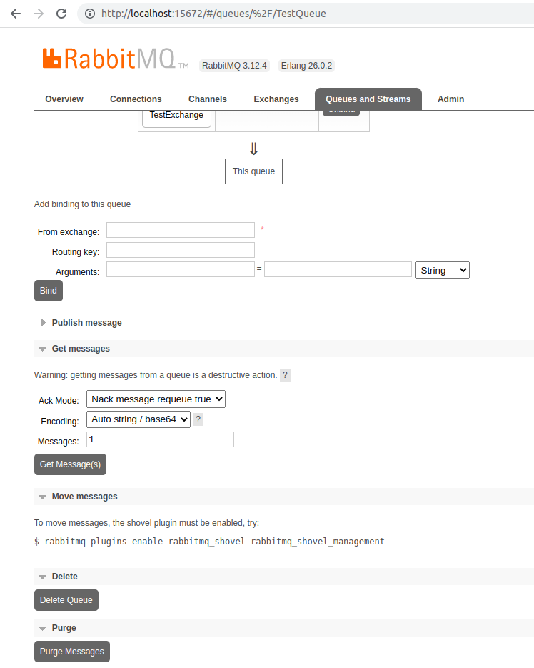

# KEDA

KEDA (Kubernetes Event-Driven Autoscaling) is an open-source project that enables Kubernetes workloads to scale based on external events. It acts as an autoscaler that works alongside the Kubernetes Horizontal Pod Autoscaler (HPA) but extends its capabilities by supporting event-driven scaling from various external sources.

### Key Features of KEDA

1. Event-Driven Scaling
   * KEDA scales applications based on events from external sources like message queues, databases, monitoring systems, and cloud services.

2. Supports Various Scalers
   * It has built-in scalers for AWS SQS, Azure Service Bus, Kafka, RabbitMQ, Prometheus, PostgreSQL, MySQL, Redis, and many more.

3. Works with Kubernetes HPA
   * KEDA works alongside HPA and extends its functionality by allowing scaling based on external metrics.

4. Efficient Resource Management
   * It can scale workloads to zero when there are no events to process, saving resources and costs.

5. Easy Deployment
   * KEDA can be installed as a lightweight custom resource definition (CRD) in Kubernetes.


### How KEDA Works

1. KEDA continuously monitors the event source (e.g., a message queue).
2. When an event threshold is met, KEDA activates the workload by scaling the number of pods accordingly.
3. Once events decrease, KEDA scales the workload back down (even to zero).


### Example Use Cases

1. KEDA can be leveraged to dynamically scale image processing pods based on messages in an Apache Kafka topic or RabbitMQ queue or AWS SQS queue.
2. KEDA can be leveraged to dynamically scale data processing pods based on Prometheus metrics indicating that memory consumption surpasses 80%.
3. KEDA can be leveraged to dynamically scale e-commerce order processing pods based on the message backlog in an Apache Kafka topic during sales events.
   This is a common use case for handling fluctuating workloads, especially during high-traffic sales events.


### Precondition

  - Kubernetes Cluster


### Installation

1. Install KEDA via Helm:

    ```sh
    helm repo add kedacore https://kedacore.github.io/charts
    helm repo update
    helm install keda kedacore/keda --namespace keda --create-namespace
    ```

2. Install RabbitMQ Server

    ```sh
    helm repo add bitnami https://charts.bitnami.com/bitnami
    helm install rabbitmq --set auth.username=guest --set auth.password=guest bitnami/rabbitmq --wait
    ```

    - Access to the RabbitMQ AMQP port:

        ```sh
        kubectl port-forward --namespace default svc/rabbitmq 5672:5672
        ```

    - Access to the RabbitMQ Management interface:

        ```sh
        kubectl port-forward --namespace default svc/rabbitmq 5672:5672
        ```


### Test

1. Go to ```http://localhost:15672/``` to open RabbitMQ management dashboard. Enter ```guest``` for both username and password.

2. Create an exchange

    

3. Create a queue

    

4. Bind the TestQueue to TestExchange

    

5. Create a KEDA Scaled Object
   
   ```kubectl apply -f scaled_object.yaml```

6. Create a deployment
   
   ```kubectl apply -f nginx-deployment.yaml```

   <b>Note:</b> After running this command, there will be 2 running nginx pods. However, after the cooldownPeriod of 10 seconds, the number of pods will drop to 0 because the TestQueue is empty.

7. Sending message to the TestQueue from TestExchange

   7.1. Write any message to Payload and press "Publish Message" like below:

      

   Initially there will be 0 nginx pod, because the TestQueue is empty:

   ```
   kubectl get pods
   NAME         READY   STATUS    RESTARTS   AGE
   rabbitmq-0   1/1     Running   0          118m
   ```

   After pressing "Publish Message" for the first time, the nginx pod will be scaled from 0 to 1. The 2nd scaling will happen after publishing the 5th message. Because every 4 messages in the TestQueue, one replica will be spawned.

   After sending the first message:
   ```
   kubectl get pods
   NAME                                READY   STATUS    RESTARTS   AGE
   nginx-deployment-544dc8b7c4-h98p8   1/1     Running   0          3s
   rabbitmq-0                          1/1     Running   0          125m
   ```

   After sending the 5th message:
   ```
   kubectl get pods
   NAME                                READY   STATUS    RESTARTS   AGE
   nginx-deployment-544dc8b7c4-h98p8   1/1     Running   0          75s
   nginx-deployment-544dc8b7c4-pzl6k   1/1     Running   0          2s
   rabbitmq-0                          1/1     Running   0          126m
   ```


   After sending the 9th message:
   ```
   kubectl get pods
   NAME                                READY   STATUS    RESTARTS   AGE
   nginx-deployment-544dc8b7c4-h98p8   1/1     Running   0          4m51s
   nginx-deployment-544dc8b7c4-pzl6k   1/1     Running   0          3m38s
   nginx-deployment-544dc8b7c4-x76vt   1/1     Running   0          8s
   rabbitmq-0                          1/1     Running   0          130m

   ```

   Let's delete all messages from the TestQueue pressing the "Purge Messages" below: 

   

   After deleting the messages, nginx pod will be scaled to 0, because the TestQueue is empty.
   ```
   kubectl get pods
   NAME         READY   STATUS    RESTARTS   AGE
   rabbitmq-0   1/1     Running   0          136m

   ```